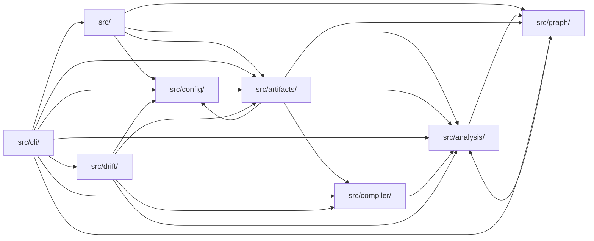

# Architecture

<!-- Maintained by CtxKeep: text between ctxkeep:start/end markers is regenerated by `ctxkeep sync`; write anywhere else. -->

<!-- ctxkeep:start:architecture sha=abc90764a36b -->
## Module dependencies

Derived from 113 resolved local imports between source files (test files excluded). A count is the number of distinct file-to-file imports behind the edge.

| Module | Files | Depends on | Used by |
|---|---|---|---|
| `(root)` | 1 | — | — |
| `src/` | 1 | `src/analysis/` (4), `src/config/` (3), `src/graph/` (3), `src/artifacts/` (1) | `src/cli/` (5) |
| `src/analysis/` | 14 | `src/graph/` (2) | `src/artifacts/` (6), `src/cli/` (5), `src/` (4), `src/drift/` (4), `src/graph/` (3), `src/compiler/` (1) |
| `src/artifacts/` | 3 | `src/analysis/` (6), `src/compiler/` (2), `src/config/` (2), `src/graph/` (2) | `src/cli/` (4), `src/` (1), `src/config/` (1), `src/drift/` (1) |
| `src/cli/` | 10 | `src/` (5), `src/analysis/` (5), `src/artifacts/` (4), `src/config/` (4), `src/compiler/` (3), `src/drift/` (2), `src/graph/` (2) | — |
| `src/compiler/` | 3 | `src/analysis/` (1) | `src/cli/` (3), `src/artifacts/` (2), `src/drift/` (1) |
| `src/config/` | 3 | `src/artifacts/` (1) | `src/cli/` (4), `src/` (3), `src/artifacts/` (2), `src/drift/` (1) |
| `src/drift/` | 3 | `src/analysis/` (4), `src/artifacts/` (1), `src/compiler/` (1), `src/config/` (1) | `src/cli/` (2) |
| `src/graph/` | 4 | `src/analysis/` (3) | `src/` (3), `src/analysis/` (2), `src/artifacts/` (2), `src/cli/` (2) |

_Plus 42 test/fixture files, not shown._
<!-- ctxkeep:end:architecture -->

<!-- ctxkeep:start:key-files sha=36ddc47f330e -->
## Key files

Entry points declared in manifests:

- `ctxkeep` → `dist/cli/index.js` (package.json bin)

Most-imported source files (change these with care):

| File | Imported by |
|---|---|
| `src/analysis/languages.ts` | 9 files |
| `src/analysis/modules.ts` | 7 files |
| `src/analysis/types.ts` | 7 files |
| `src/analysis/walker.ts` | 6 files |
| `src/config/io.ts` | 6 files |
| `src/analysis/model.ts` | 5 files |
| `src/cli/shared.ts` | 5 files |
| `src/compiler/markers.ts` | 5 files |
| `src/pipeline.ts` | 5 files |
| `src/artifacts/agents.ts` | 4 files |
<!-- ctxkeep:end:key-files -->
