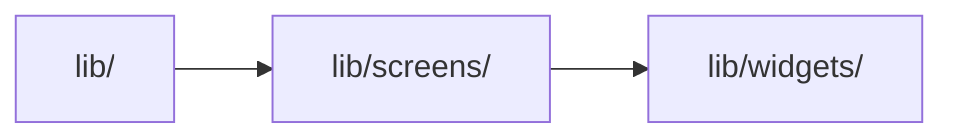

# Architecture

<!-- Maintained by CtxKeep: text between ctxkeep:start/end markers is regenerated by `ctxkeep sync`; write anywhere else. -->

<!-- ctxkeep:start:architecture sha=65491e481437 -->
## Module dependencies

Derived from 3 resolved local imports between source files (test files excluded). A count is the number of distinct file-to-file imports behind the edge.

| Module | Files | Depends on | Used by |
|---|---|---|---|
| `android/` | 1 | — | — |
| `ios/` | 1 | — | — |
| `lib/` | 1 | `lib/screens/` (1) | — |
| `lib/screens/` | 2 | `lib/widgets/` (2) | `lib/` (1) |
| `lib/widgets/` | 1 | — | `lib/screens/` (2) |

_Plus 1 test/fixture file, not shown._

_Kotlin, Swift files are tracked at file level only: their symbols and imports are not indexed._
<!-- ctxkeep:end:architecture -->

<!-- ctxkeep:start:key-files sha=97acad4d934e -->
## Key files

Most-imported source files (change these with care):

| File | Imported by |
|---|---|
| `lib/widgets/app_button.dart` | 2 files |
<!-- ctxkeep:end:key-files -->
