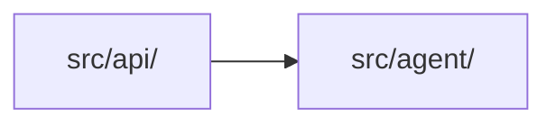

# Architecture

<!-- Maintained by CtxKeep: text between ctxkeep:start/end markers is regenerated by `ctxkeep sync`; write anywhere else. -->

<!-- ctxkeep:start:architecture sha=8e028750f629 -->
## Module dependencies

Derived from 5 resolved local imports between source files (test files excluded). A count is the number of distinct file-to-file imports behind the edge.

| Module | Files | Depends on | Used by |
|---|---|---|---|
| `src/agent/` | 4 | — | `src/api/` (2) |
| `src/api/` | 1 | `src/agent/` (2) | — |

_Plus 3 test/fixture files, not shown._
<!-- ctxkeep:end:architecture -->

<!-- ctxkeep:start:key-files sha=aac66e1d5e03 -->
## Key files

Entry points declared in manifests:

- `support-agent` → `agent.cli:main` (pyproject.toml [project.scripts])

Most-imported source files (change these with care):

| File | Imported by |
|---|---|
| `src/agent/llm.py` | 2 files |
| `src/agent/prompts.py` | 2 files |
<!-- ctxkeep:end:key-files -->
