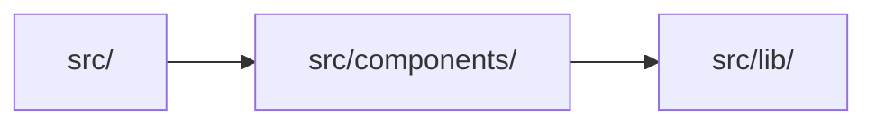

# Architecture

<!-- Maintained by CtxKeep: text between ctxkeep:start/end markers is regenerated by `ctxkeep sync`; write anywhere else. -->

<!-- ctxkeep:start:architecture sha=836fd0a6410e -->
## Module dependencies

Derived from 5 resolved local imports between source files (test files excluded). A count is the number of distinct file-to-file imports behind the edge.

| Module | Files | Depends on | Used by |
|---|---|---|---|
| `src/` | 2 | `src/components/` (2) | — |
| `src/components/` | 2 | `src/lib/` (1) | `src/` (2) |
| `src/lib/` | 2 | — | `src/components/` (1) |

_Plus 3 test/fixture files, not shown._
<!-- ctxkeep:end:architecture -->

<!-- ctxkeep:start:key-files sha=6ecd88e38766 -->
## Key files

Most-imported source files (change these with care):

| File | Imported by |
|---|---|
| `src/components/Button.tsx` | 2 files |
<!-- ctxkeep:end:key-files -->
